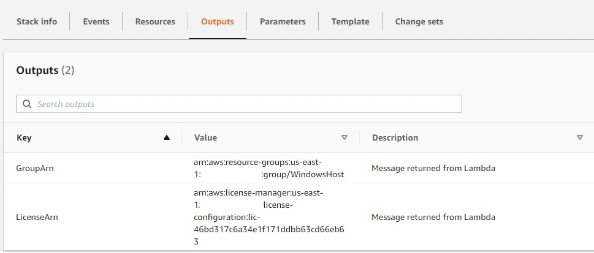

== Post-deployment steps

=== Review License Manager Rules

To get started with License Manager, open the License Manager console at https://console.aws.amazon.com/license-manager/. 

In the left navigation pane, choose *Customer managed licenses*.

=== Review Host Resource Group

To review the host resource group configuration, open the License Manager console at https://console.aws.amazon.com/license-manager/.

In the left navigation pane, choose *Host resource groups*.

=== Provisioning

License Manager supports different deployment options to enforce license rules:

* Launch Template and AMI
* CloudFormation
* AWS SDK's and tools
* AWS Service Catalog

Once the Quick Start deployment completes, navigate to the output section of the CloudFormation stack to record the following:

* GroupArn - This is the host resource group ARN
* LicenseArn - This is license configuration ARN

In this deployment guide, we will show how to provision using Launch Template, AWS CLI, and CloudFormation. 
For other deployment methods, you may refer to AWS documentation. https://aws.amazon.com/blogs/mt/mechanisms-to-govern-license-usage-with-aws-license-manager/

==== Autoscaling

The Quick Start will create a Launch Template and Auto Scaling Group using two private subnets.
LaunchTemplateData is configured with 

        Placement:
          HostResourceGroupArn: <Replace with host resource group ARN>
        LicenseSpecifications:
          - LicenseConfigurationArn: <Replace with License Configuration ARN>

Auto scaling is configured to take advantage of multiple Availability Zones represented by the private subnets used by the auto scaling group.
Therefore, auto scaling should be carefully considered depending on the workload you plan to run on Dedicated Host infrastructure.

By default, the auto scaling value is set to 0. If, for example, you set the desired, min and max values to 2 during the deployment, you will launch two instances utilizing both Availability Zones. This mean 1 dedicated host will be allocated for you per Availability Zone. 

==== AWS CLI

    aws ec2 run-instances \
    --instance-type c5.2xlarge \
    --image-id ami-0eXXXXXXXXXXXXef9  \
    --subnet-id subnet-0fdbxxxxxxxdcf \
    --license-specifications <License Configuration ARN> \
    --placement HostResourceGroupArn= <Host resource group ARN>

==== CloudFormation

To deploy using CloudFormation, ensure the resource properties include both HostResourceGroupArn & LicenseSpecifications

    Type: AWS::EC2::Instance
    Properties: 
    AvailabilityZone: String
    BlockDeviceMappings: 
        - BlockDeviceMapping
    HostResourceGroupArn: String <Replace with host resource group ARN>
    IamInstanceProfile: String
    ImageId: String
    InstanceType: String
    KeyName: String
    LaunchTemplate: 
        LaunchTemplateSpecification
    LicenseSpecifications: 
        - LicenseSpecification
    SecurityGroupIds: 
        - String
    SecurityGroups: 
        - String
    SourceDestCheck: Boolean
    SsmAssociations: 
        - SsmAssociation
    SubnetId: String
    Tags: 
        - Tag
    Tenancy: String
    UserData: String
    Volumes: 
        - Volume

=== Validate License Manager dashboard

The Dashboard section of the AWS License Manager console provides graphs to track the license consumption associated with each license configuration. The dashboard also displays alerts resulting from license rule violations.

The following information is available in the graph for a license configuration:

* License configuration name
* License type
* Licenses consumed
* Number of licenses remaining
* Whether the rules are enforced
* Number of hosts for each tenancy type

=== Track usage through the built-in dashboard
Open the License Manager console at https://console.aws.amazon.com/license-manager/
In the left navigation pane, choose Dashboard.

=== Run Windows updates

If you deployed any Windows instances, in order to ensure the deployed servers' operating systems and installed applications have the latest Microsoft updates, run Windows Update on each server.

* Create an RDP session from the Remote Desktop Gateway server to BYOL Windows server.
* Open the Settings application.
* Open Update & Security.
* Click Check for updates.
* Install any updates and reboot if necessary.

