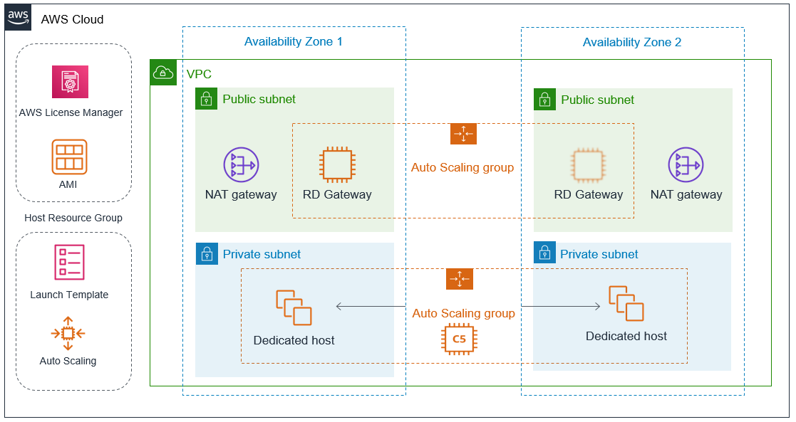
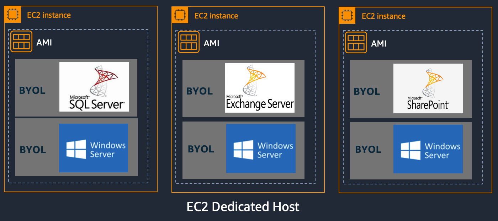
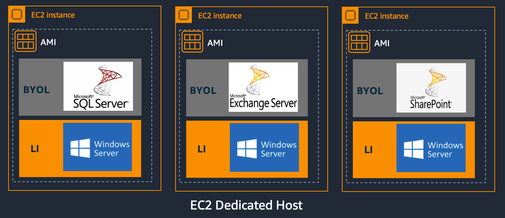

:xrefstyle: short

Deploying this Quick Start for a new virtual private cloud (VPC) with
default parameters builds the following {partner-product-short-name} environment in the
AWS Cloud.

// Replace this example diagram with your own. Follow our wiki guidelines: https://w.amazon.com/bin/view/AWS_Quick_Starts/Process_for_PSAs/#HPrepareyourarchitecturediagram. Upload your source PowerPoint file to the GitHub {deployment name}/docs/images/ directory in this repo. 

[#architecture1]
.Quick Start architecture for {partner-product-short-name} on AWS

As shown in <<architecture1>>, the Quick Start sets up the following:

* A highly available architecture that spans two Availability Zones.*
* A VPC configured with public and private subnets, according to AWS
best practices, to provide you with your own virtual network on AWS.*
* In the public subnets:
** Managed network address translation (NAT) gateways to allow outbound
internet access for resources in the private subnets.*
** An optional Remote Desktop Gateway in an Auto Scaling group to allow inbound Remote Desktop Protocol
(RDP) access to EC2 instances in public and private subnets.*
* In the private subnets:
** An optional Auto Scaling group of dedicated host instances.
// Add bullet points for any additional components that are included in the deployment. Make sure that the additional components are also represented in the architecture diagram. End each bullet with a period.
* An AWS License Manager license configuration associated with Host Resource Group.
* An AWS License Manager & Host Resource Group associated with the Auto Scaling group in the private subnets.

[.small]#* The template that deploys the Quick Start into an existing VPC skips the components marked by asterisks and prompts you for your existing VPC configuration.#

== Advantages ==

. Benefit from the efficiencies of the AWS Cloud while utilizing existing investments in on-premises
software
. Extend the lifecycle of prior software versions
. Import your existing Windows images to the AWS Cloud
. Easily track licenses using AWS License Manager
. Enforce licensing rules,stay compliant and control overages
. Centrally report usage and discover installed software

== Use cases ==

=== Eligible Software 

You can leverage a variety of existing software licenses on AWS using Amazon EC2 Dedicated hosts.

Example include: 

*  Microsoft Windows Server
*  Microsoft SQL Server
*  Microsoft Remote Desktop Services
*  Microsoft Exchange Server 
*  Microsoft SharePoint Server 
*  All other software covered under the Microsoft product terms

=== BYOL Windows for Eligible Software ===

Import your own VM Images using VM Import/Export or host based replication software to create Amazon Machine Image ( AMI)

=== Windows License Included for Eligible Software ===

You can also run license included Windows Server instances on EC2 Dedicated Hosts, which enables you to use fully compliant Windows Server software licenses from AWS with a pay-as-you-go model. 
This helps in scenarios where you have eligible software licenses to use on Dedicated Hosts but do not have accompanying Windows Server licenses to run the eligible software to Dedicated host environment. 

You can use the Windows Server AMIs via the AWS Management Console, APIs, and CLI

